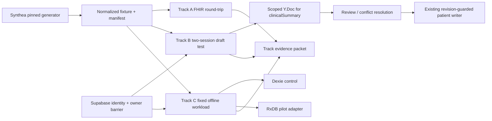

# Architecture rationale: third-party enhancement pilots

**Status:** Draft implementation architecture for pilot planning
**Date:** 2026-08-22
**Inputs:** `.specs/tasks/draft/third-party-enhancements.feature.md`,
`.specs/analysis/research-third-party-enhancements.md`,
`.specs/analysis/analysis-third-party-enhancements.md`, and
`.specs/analysis/business-third-party-enhancements.md`

## Executive decision

Run three isolated, reversible pilots around the existing RR2 clinical-data
and safety boundaries:

- **A — Synthea:** deterministic, no-PHI fixtures and a FHIR
  import/render/export/re-import comparison.
- **B — Yjs:** one authenticated, review-only `clinicalSummary` draft field
  for at most two sessions. Yjs supplies document synchronization; RR2 still
  owns identity, authorization, audit, conflict review, and chart writes.
- **C — RxDB:** a measurement-only comparison with the current Dexie/
  IndexedDB path for one `draft_field` workload. RxDB is not a second source
  of truth and does not get a production replication endpoint in this task.

The pilot introduces adapters and test seams, not a generalized collaboration
platform, a patient-wide CRDT model, or an offline-stack migration. The
existing patient/round contract, RLS, revision guards, completion guards,
recovery export, and owner-transition cleanup remain the control plane.

## Architecture posture and sequence

1. Lock the current control behavior and fixture manifest.
2. Run Track A and publish its manifest/hash.
3. Run Tracks B and C independently against that same synthetic manifest.
4. Run shared safety, privacy, accessibility, dependency, and rollback gates.
5. Record three independent decisions. A passing track authorizes only a
   separately approved implementation plan for that track.

No pilot may silently enable a production flag, write directly to a chart,
replace Dexie, or add a third-party service to a production tenant.

## Current-to-target mapping

The current implementation is the comparison baseline. The target is a
pilot-only path behind an authenticated feature flag; it is not a request to
edit these application files during the planning task.

| Current surface | Current responsibility | Target pilot behavior | Boundary and rollback |
| --- | --- | --- | --- |
| `app/src/collab/CollaborationProvider.tsx` (`CollaborationProvider`) | Creates one broad local `Y.Doc`, exposes a `PatientNoteStore`, and tracks cursor-like presence. It is not currently an authenticated provider-tree integration or a server-backed room. | Add a separate `PilotCollaborationProvider`/adapter that is mounted only below the resolved auth boundary and only for one authorized `{tenant/team, patient, round, clinicalSummary}` document. It owns authorization, `WebsocketProvider`, awareness, status, restart epoch, kill-switch state, and teardown. | Do not broaden or silently repurpose the existing provider. With the flag off, the current path is unchanged. Removing the pilot unmounts the pilot provider and destroys only its named stores. |
| `app/src/collab/patient.store.ts` | `@syncedstore/core` stores `notes` and `cursors` keyed by `${patientId}:${system}`; it is a broad patient/system map and mixes note content with presence-like state. | Replace the pilot document store at the pilot boundary with a `ClinicalSummaryDraftAdapter` that owns a single `Y.Doc` and a single canonical rich-text root for `clinicalSummary`. Presence moves to Yjs awareness; it is not persisted in the draft document. The adapter carries owner, document scope, base revision, actor, and recovery metadata outside the note body. | Keep `patient.store.ts` as the control implementation for existing behavior. Do not migrate its map or its data into a new global store. Pilot state is namespaced, discoverable by cleanup, and removable without touching Dexie or chart data. |
| `@syncedstore/core` and `@syncedstore/react` | Existing runtime dependencies used by `patient.store.ts` and collaboration hooks to make Yjs-backed objects reactive. | Do not use `syncedStore` as the target clinical-summary representation. The pilot uses direct Yjs APIs (`Y.Doc`, a single `Y.XmlFragment` root, transactions, and awareness) behind a typed adapter; React receives serialized HTML and explicit status. This is the explicit wrap/replacement seam: the pilot replaces the store/provider only inside the flagged surface, not globally. | Keep the existing packages because the current control path still needs them. Removing or upgrading them is outside this task. A later migration may remove them only after the control path is retired and regression evidence exists. |
| `Patient.clinicalSummary` / `clinical_summary` | Existing canonical patient field. `PatientFocus` passes it through the normal single-writer/update and revision-guarded remote path. | Treat it as the chart field represented by a review-only Yjs draft. A draft has a captured server revision and never becomes chart state until the user explicitly reviews and applies it through the existing writer. | The existing field writer, conflict dialog, completion guards, and recovery export remain authoritative. A failed or stale apply leaves the draft quarantined/exportable; it never falls back to last-writer-wins. |
| `app/src/components/RichTextEditor.tsx` | Controlled HTML editor with `value`/`onChange`, sanitization/change-tracking hooks, and accessibility labels. | Wrap it with `CollaborativeClinicalSummarySurface`: convert editor HTML to a deterministic, sanitized `Y.XmlFragment`; observe Yjs changes and serialize back to the editor; preserve the existing toolbar, labels, focus, and review/apply affordances. Unsupported markup is normalized and reported, never silently discarded. | Do not rewrite `RichTextEditor` for the pilot. If the serializer cannot preserve a construct, the pilot marks the document as normalization/conflict-review required and the evidence packet records it. Removing the wrapper restores the existing editor. |

### Explicit Yjs wrapping/replacement strategy

The current `CollaborationProvider` and `patient.store.ts` are not wrapped by
another `syncedStore` layer. That would preserve the broad patient map and make
authorization and cleanup ambiguous. Instead:

1. Keep the current provider/store as the current collaboration control and
   leave it unchanged while the flag is off.
2. Add a pilot-only adapter that creates a fresh `Y.Doc`, one `Y.XmlFragment`
   root for the selected rich-text field, and one authenticated provider per
   authorized document. The adapter exposes a narrow interface:
   `load`, `applyLocalChange`, `observe`, `status`, `exportRecovery`, `quiesce`,
   and `destroy`.
3. Mount the adapter through a new `CollaborativeClinicalSummarySurface`
   around the existing `RichTextEditor`. The editor remains the UI/editor
   engine; the adapter is the synchronization engine. The adapter must not
   call the patient writer.
4. Use Yjs awareness only for ephemeral presence. Do not put actor history,
   patient identifiers, or audit records in the Y.Doc. Store metadata-only
   audit events through the existing approved path or retain them in the
   evidence packet for the disposable pilot.
5. If the pilot is removed, unmount the wrapper, close the provider, destroy
   the local persistence namespace, and return to the current field writer.
   No data migration is required because the pilot document is never the
   chart source of truth.

## Shared contracts

### Identity, ownership, and privacy

- The existing Supabase session is the only identity source. The server
  authorizes the exact tenant/team, patient, round, and `clinicalSummary`
  scope before accepting a WebSocket upgrade or serving a document.
- Room/document IDs are opaque and server-issued. URLs and query parameters
  contain no bearer token, patient identifier, note content, or room secret.
  `y-websocket` is transport, not authorization.
- Every Yjs, RxDB, and Dexie pilot record is owner- and pilot-namespaced. The
  owner is captured at open/enqueue time and checked again before read, write,
  drain, export, or purge. Client selectors are not security controls.
- Sign-out, token expiry, account switch, and reload during an identity
  transition must close providers, stop drains, and clear sensitive local
  state through `ownerTransitionBarrier`, `syncAuthTransitionGate`, and
  `clearSensitiveClientState` before another owner can open data.
- Only Synthea data and the seeded non-PHI test account are allowed. Logs and
  telemetry contain opaque IDs, counts, durations, statuses, queue age,
  conflict counts, cleanup results, and error classes—not note text, patient
  identifiers, FHIR payloads, CRDT updates, room tokens, or recovery content.

### Chart-write and same-field conflict behavior

The pilot must make same-field behavior explicit:

- **Disjoint online edits:** Yjs converges the document. The UI shows the
  connected actors and the document remains review-only.
- **Same-field edits while offline:** on open, capture the server field
  revision and a base digest. On reconnect, if both actors changed the same
  `clinicalSummary` base, mark `needs-review`; do not silently select a user,
  auto-apply the merged result, or claim chart persistence. Preserve the
  merged candidate plus actor/base-revision metadata and expose the local,
  remote, and merged/reviewable choices through the existing conflict review
  path. A reviewer may keep the merged result, choose one version, manually
  revise it, or discard it.
- **Explicit apply:** submit the reviewed value with the captured revision to
  the existing revision-guarded patient writer. A stale-revision response
  returns the draft to `needs-review` and creates a recovery export; it never
  retries with last-writer-wins.
- **No-op or single-writer reconnect:** if the server revision is unchanged,
  or only one side changed, the candidate can be presented as ready for review,
  but still requires the explicit apply action.

### WebSocket interruption and server-restart recovery

- A connection interruption changes the visible status to offline/reconnecting;
  local editing is allowed only while the pilot is admitted and the local
  persistence is healthy. No UI may say “saved remotely” until an authorized
  server acknowledgment is recorded.
- `y-indexeddb` persists unacknowledged updates under a namespaced document
  key. On reconnect the client resends them with the captured base revision and
  idempotency metadata. Duplicate acknowledgments are harmless and counted.
- The WebSocket service returns a room/server epoch during handshake. If the
  epoch changes or a room is empty after a server restart, the client must not
  replace a populated local document with an empty server document. It enters
  `server-restarted/recovery-required`, keeps the local copy read-only, and
  offers an authorized recovery export/quarantine.
- Recovery then compares the local candidate with any server snapshot/revision:
  local-only content is preserved, server-newer content is shown for review,
  and a same-field divergence follows the conflict rules above. Rejoin and
  apply are separate explicit actions.
- If an authorized client has no local copy and the disposable server held no
  durable snapshot, the result is an unrecoverable-loss failure and an
  immediate no-go. Durable server snapshots/update logs are required before
  production consideration; ephemeral room state is acceptable only as a
  visibly limited pilot condition.

### Safe kill-switch and rollback sequence

The kill switch is an ordered, fail-closed operation. It applies to Yjs and
RxDB pilot state and must be safe during a network partition:

1. **Stop admission.** Atomically set the pilot flag off at the server/config
   boundary and client boundary. Reject new room/document admission and new
   RxDB pilot opens; existing sessions become read-only. Record the flag
   version and timestamp.
2. **Quiesce.** Mark active documents draining; stop local edits, queue drains,
   retries, and replication. Ask providers to flush only already-acknowledged
   state, then close WebSockets after a bounded timeout. Do not wait forever
   for an unavailable server or create new writes while waiting.
3. **Export or quarantine.** For each active/recoverable draft, verify owner
   and document scope, write a review-only recovery export with an opaque ID,
   base revision, status, checksum, and export result, and mark it immutable.
   If export cannot be verified, quarantine the namespaced local database
   read-only and block purge; never silently discard it.
4. **Purge only confirmed-safe state.** After the inventory and checksums are
   recorded, destroy only the named pilot Yjs/RxDB namespaces whose providers
   are closed and whose exports are verified (or whose state is confirmed
   empty). Preserve Dexie, existing recovery exports, chart data, and any
   uncertain/quarantined namespace. Never issue a broad IndexedDB purge.
5. **Verify and report.** Prove no new admission, no active pilot provider,
   no pilot state readable by a new owner, and normal Dexie/chart behavior.
   Attach the inventory, export/quarantine results, purge list, failures, and
   operator sign-off to the evidence packet. Re-enable only through a new
   decision; rollback is not an implicit re-admission.

### Dependency boundary

| Classification | Dependencies/tooling | Rule |
| --- | --- | --- |
| Existing runtime/control | `@syncedstore/core@^0.6.0`, `@syncedstore/react@^0.6.0`, `yjs@^13.6.29`, `y-indexeddb@^9.0.12`, `dexie@^4.3.0`, Supabase client, and existing Playwright/test tooling | These are already present and define the current control behavior. Do not remove, upgrade, or reinterpret them as part of planning. |
| Existing but not a production collaboration service | The local Yjs document code under `app/src/collab/` and existing cleanup/owner-transition code | Treat the current provider as a control, not as proof of authenticated multi-user collaboration. |
| New pilot-only candidates | A pinned WebSocket client/server package if direct WebSocket hosting is required; `rxdb` and only the storage/replication plugin needed for the benchmark; Synthea plus its pinned Java/toolchain distribution | Add only in a separate pilot branch/entry point after license/version review. Keep out of the normal production bundle and remove with the pilot. Synthea is test tooling, not a browser dependency. |
| Not authorized by this architecture | New production replication service, server-side CRDT persistence, Supabase migration, or broad dependency upgrade | These require a separate implementation decision and cannot be smuggled in as pilot plumbing. |

The evidence packet must distinguish “already installed” from “added for this
pilot,” include exact versions/commits and licenses for both, and report bundle,
lockfile, transitive-dependency, and support impact.

## Track A — Synthea fixture pipeline

Run the pinned generator in a disposable directory with fixed seed, Java major
version, modules, locale/timezone, geography, reference date, and population
size. Validate no-PHI output, normalize Patient, Observation, medication,
AllergyIntolerance, and encounter/timeline resources, and write a manifest with
resource counts, normalization version, and content hash. Load the normalized
fixture through the existing FHIR/import path, render it, export/re-import it,
and classify at least 20 named field differences as preserved, normalized,
intentionally lossy, or unsupported. Missing values render as `Not documented`.

Use the real E2E reset module at `app/e2e/fixture-state.ts`.

## Track B — Yjs collaboration pilot

The pilot is limited to one `clinicalSummary` field, synthetic patients, two
authorized sessions, and a pilot flag defaulting off. The WebSocket upgrade
authenticates the Supabase session and authorizes the exact document before
`handleUpgrade`. A long-lived WebSocket service is not assumed to run in a
Supabase Edge Function.

Target modules are a scoped provider/adapter, document serializer, room
authorization, persistence/recovery, audit metadata, and
`CollaborativeClinicalSummarySurface`. Existing presence components may be
reused only if their status remains truthful. A two-context E2E matrix covers
disjoint edits, same-field offline edits, sign-out/expiry, reload, network
interruption, server restart/epoch change, review/apply, export, and the full
kill-switch sequence.

## Track C — RxDB comparison pilot

Compare a quarantined RxDB adapter with the current Dexie adapter using the same
synthetic manifest, browser/device, auth state, workload, and failures. Use at
least 3 patients, 20 mutations, 30 applicable benchmark repetitions, and 20
offline/reconnect correctness runs. The candidate must preserve zero silent
loss, zero duplicate committed mutations, terminal status visibility, owner
isolation, completion guards, and recovery export.

### Baseline metrics and decision threshold

The baseline is the current Dexie/IndexedDB path measured before the candidate
in the same environment. Pre-register the workload and collect at least 30
runs for each applicable timing metric; report raw values, median, p95, sample
count, and candidate delta:

- cold startup/database open and hydrate/read latency;
- local write and enqueue latency;
- reconnect-to-drain-complete time and maximum queue age;
- storage bytes per fixed workload;
- conflict count, retry count, duplicate committed mutation rate, silent-loss
  count, failed-write recovery rate, terminal-status visibility, and
  owner-isolation failures.

RxDB proceeds only if it has **at least one pre-registered p95 latency metric
with a >=20% improvement**, calculated as
`(Dexie baseline p95 - RxDB p95) / Dexie baseline p95`, while having zero silent
loss, zero duplicate committed mutations, zero owner leaks, 100% visible
terminal status, and no regression greater than 10% in any safety-critical
metric. A benchmark that does not meet that threshold is a no-go or extension,
not a reason for a broad rewrite.

## Evidence packet, ownership, and decision dates

Each track must publish one immutable evidence packet before its decision date.
The packet fields are:

| Field | Required value/owner |
| --- | --- |
| Packet ID, track, hypothesis, scope, and pilot flag | Technical owner |
| Technical owner and accountable business decision owner | Named person before execution; role alone is not sufficient for sign-off |
| Clinical-safety reviewer and privacy/security reviewer | Named reviewers; both must sign the safety gate |
| Planned decision date and actual decision timestamp | Accountable business decision owner; planned dates below are the schedule baseline |
| Exact dependency versions/commits, licenses, and existing-vs-new classification | Technical owner with security/license reviewer |
| Fixture manifest hash, account classification, environment, browser/device, seed, and workload | Technical owner; no-PHI reviewer verifies data provenance |
| Test matrix, failure injection, baseline definition, metric formulas, raw results, and pass/fail interpretation | Technical owner; verifier independently checks calculations |
| Authorization, accessibility, privacy, audit/provenance, conflict, restart, and owner-isolation evidence | Security/privacy, accessibility, and clinical-safety reviewers |
| Kill-switch inventory, export/quarantine evidence, purge list, rollback rehearsal, limitations, and unresolved risks | Release owner and technical owner |
| Decision: proceed to separate implementation, extend pilot, or stop; next action and due date | Business decision owner with required reviewer signatures |

| Track | Technical owner | Clinical-safety reviewer | Privacy/security reviewer | Business decision owner | Planned decision date |
| --- | --- | --- | --- | --- | --- |
| A — Synthea | Fixture/interop lead (name required before run) | Clinical-safety lead (name required) | Privacy lead (name required) | Product/release owner (name required) | 2026-09-05 |
| B — Yjs | Collaboration lead (name required before run) | Clinical-safety lead (name required) | Security/privacy lead (name required) | Product/release owner (name required) | 2026-09-12 |
| C — RxDB | Offline/persistence lead (name required before run) | Clinical-safety lead (name required) | Security/privacy lead (name required) | Product/release owner (name required) | 2026-09-12 |
| Shared final gate | Release owner | Clinical-safety lead | Security/privacy lead | Product/release owner | 2026-09-19 |

The dates are planning targets, not approvals. A packet with `TBD` names,
missing reviewer signatures, missing raw results, or an untested rollback is
incomplete and cannot receive a proceed decision.

## Release gates and deferred decisions

The final status remains **NO-GO for production implementation** until every
track has its packet, named owners, reviewer sign-off, and tested removal path.
Any PHI exposure, wrong-patient access, silent loss/duplication, unreviewed
chart mutation, owner leak, critical accessibility blocker, or failed recovery
is an immediate no-go.

Do not decide during this pilot: the long-lived WebSocket runtime, durable Yjs
snapshot/update-log design, durable collaboration audit schema/retention,
RxDB replication/checkpoint/tombstone contracts, broad field/user expansion,
or production dependency/bundle acceptance. Those are separate implementation
decisions after evidence.
